```{python}
#| label: chunk_6c_antes
#| echo: false
#| eval: false

# Instalar, se necessário: !pip install scorecardpy
import sys
!{sys.executable} -m pip install scorecardpy
```

---

{width=100% fig-align="center"}

---


{width=100% fig-align="center"}

---

## Você já passou por isso?

- limite do cartão aumentado ou reduzido  
- crédito negado sem explicação clara  
- financiamento aprovado para uns e não para outros  

Pergunta:

> Como essas decisões são tomadas?

> Existe um critério? Um modelo? Ou é arbitrário?

---

## Perfis diversos

{width=100% fig-align="center"}

Decisões de crédito são tomadas com base em informações incompletas e envolvem incerteza sobre o comportamento futuro do cliente.

---

## O que é risco?

Risco está associado a duas coisas:

- incerteza sobre o futuro  
- possibilidade de perda  

Podemos pensar risco como:

> chance de algo indesejado acontecer + impacto dessa ocorrência  

No nosso contexto:

> risco de crédito = inadimplência + perda financeira associada


---

## Onde esse problema aparece?

O risco de crédito está presente em diversas situações:

- empréstimos pessoais  
- cartão de crédito  
- financiamento  
- crédito estudantil  
- fintechs  
- crediário  
- análise para empresas  

---

## Onde está o problema?

Pergunta central:

> Dado um cliente, qual é o risco de inadimplência?

Essa pergunta está por trás de decisões que afetam milhões de pessoas todos os dias.


---

## Por que isso é difícil?

Considere dois clientes:

- mesma renda  
- mesma idade  
- histórias diferentes  

Um paga, outro não.

Perguntas:

> O que diferencia esses clientes?

> Como transformar isso em uma regra de decisão?

---

## Uma decisão simples na aparência

Uma instituição financeira recebe pedidos de crédito diariamente.

- 1000 clientes solicitam crédito  
- parte pagará corretamente  
- parte atrasará  
- parte não pagará  

---

## O problema

A decisão precisa ser tomada antes de observar o resultado.

> O comportamento futuro do cliente não é conhecido no momento da concessão.

> A decisão é feita sob incerteza [@hand_henley_1997].

---

## A decisão

Perguntas centrais:

- Quem aprovar?  
- Quem rejeitar?  
- Em quais condições?  

> Esse é o problema central da modelagem de risco de crédito.

---

## A decisão

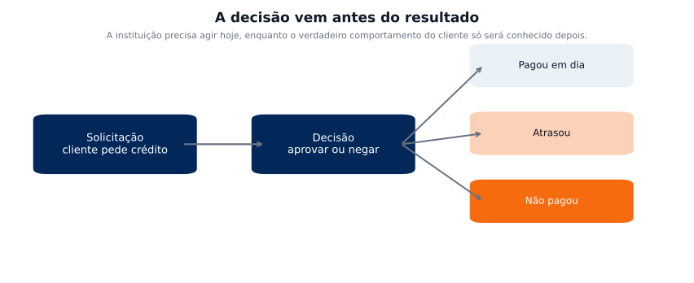{width=100% fig-align="center"}

Do dado à decisão, o modelo atua como uma ponte que transforma informação em estimativa de risco.

---

## Nem todo erro custa a mesma coisa

Duas decisões incorretas possíveis:

- Aprovar um cliente inadimplente → perda financeira direta  
- Negar um cliente adimplente → perda de receita  

Esses erros não são equivalentes.

Exemplo real:

- bancos preferem perder um bom cliente a assumir prejuízo com inadimplência  

> Em crédito, errar faz parte — o importante é o custo do erro.

---

## Como organizar esses erros?

Podemos representar essas decisões em uma estrutura simples:

- o que aconteceu de fato  
- o que o modelo decidiu  

> Isso nos permite analisar os tipos de erro.

---

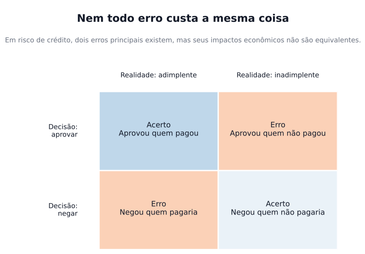{width=100% fig-align="center"}

---

## Então qual é o problema real?

O ideal seria:

- prever perfeitamente quem não paga  
- eliminar completamente os erros  

Mas isso não é possível.

Então o objetivo passa a ser:

> tomar decisões melhores em um cenário de incerteza

> considerando o impacto de cada tipo de erro.

---

## Impacto econômico dos erros

Podemos quantificar os erros:

- **Falso positivo (FP)**: aprovar quem não paga  
- **Falso negativo (FN)**: negar quem pagaria  

Em termos de quantidade:

- **FP**: número de inadimplentes aprovados  
- **FN**: número de bons clientes rejeitados  

Cada erro tem um custo associado:

- $\text{custo}_{FP}$: perda média ao aprovar um cliente inadimplente  
- $\text{custo}_{FN}$: lucro não realizado ao rejeitar um cliente adimplente  

---

## Interpretando os custos

Exemplo:

- aprovar um cliente inadimplente pode gerar perda de R$ 800  
- rejeitar um cliente adimplente pode significar deixar de ganhar R$ 100  

Ou seja:

$$
\text{custo}_{FP} > \text{custo}_{FN}
$$

O custo total das decisões pode ser representado por:

$$
\text{Custo} = \text{custo}_{FP} \cdot FP + \text{custo}_{FN} \cdot FN
$$

> O objetivo não é minimizar erros, mas minimizar o custo total.

---

## Como medir o risco?

Vimos que decisões têm custos.

**Mas como quantificar esse risco antes de decidir?**

Precisamos responder:

- qual a chance de inadimplência?  
- quanto se perde se isso acontecer?  
- quanto está em risco?  

> O risco pode ser decomposto em componentes.

---

## A linguagem do risco de crédito

$$
\text{Perda Esperada} = PD \times LGD \times EAD
$$

em que:

- *Probability of Default* (*PD*) → probabilidade de inadimplência  
- *Loss Given Default* (*LGD*) → proporção da perda caso ocorra inadimplência  
- *Exposure at Default* (*EAD*) → valor exposto no momento do default  

Interpretação:

> Essa estrutura organiza o risco em três componentes principais.

---

## Como interpretar?

A perda esperada combina:

- chance de não pagar  
- proporção da perda  
- valor em risco  

Ou seja:

> perda esperada = chance × perda × exposição  

> Essa estrutura é adotada em Basileia [@basel_framework; @eba_pd_lgd].

---

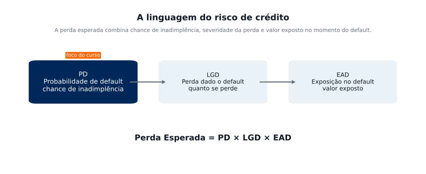{width=95% fig-align="center"}

Exemplo:

PD = 10%, LGD = 50%, EAD = R\$ 1000

> perda esperada = $0,10 \times 0,50 \times  R\$ \ 1000 = R\$ \ 50$


## Onde entra o modelo?

Entre esses três componentes:

- PD  
- LGD  
- EAD  

Neste curso, vamos focar em:

> modelar a probabilidade de inadimplência (PD)

---

## Por que esse problema é importante?

- decisões financeiras reais  
- impacto econômico direto  
- milhões de clientes afetados  

Contexto regulatório:

- Basileia exige gestão estruturada de risco  

> Modelos de crédito são fundamentais para o sistema financeiro [@basel2; @basel3final].

---

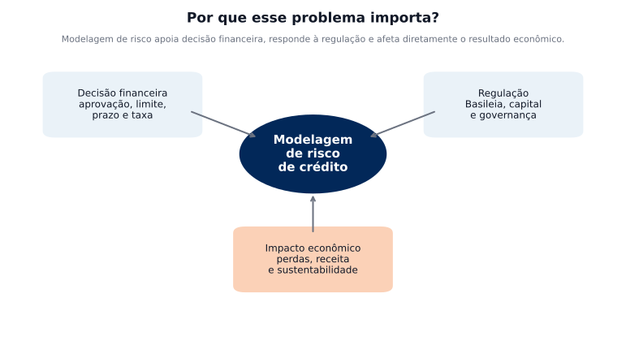{width=95% fig-align="center"}

Modelar risco de crédito não é apenas um problema técnico:

> é uma decisão com impacto econômico real.

---

## O problema estatístico

Definimos a variável resposta:

$$
Y =
\begin{cases}
1, & \text{se o cliente for inadimplente} \\
0, & \text{se o cliente for adimplente}
\end{cases}
$$

Nosso objetivo é modelar:

$$
P(Y=1 \mid X)
$$

> a probabilidade de um cliente se tornar inadimplente dado seu perfil

em que $X$ representa informações do cliente, como:

- idade, renda, valor e duração do crédito  
- histórico de pagamento, tipo de emprego ou estabilidade  

---

## 

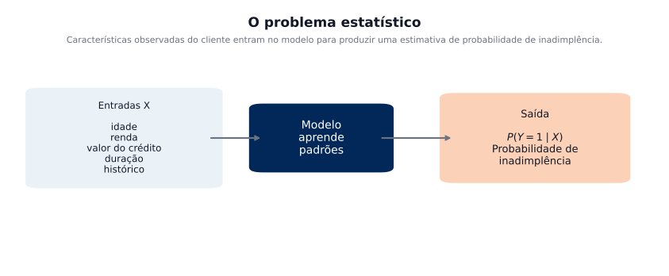{width=95% fig-align="center"}
O problema de crédito pode ser formulado como a estimação da probabilidade de inadimplência.

---

## Tipos de modelos de crédito

- *Application scoring* → antes da concessão  
  (decidir se aprova ou não o crédito)

- *Behavioral scoring* → durante o relacionamento  
  (ajustar limite, risco ao longo do tempo)

- *Collection scoring* → após atraso  
  (definir estratégia de cobrança)

Cada modelo responde a uma pergunta diferente.

> O tipo de modelo depende do momento da decisão e dos dados disponíveis [@eba_loan_monitoring].

---

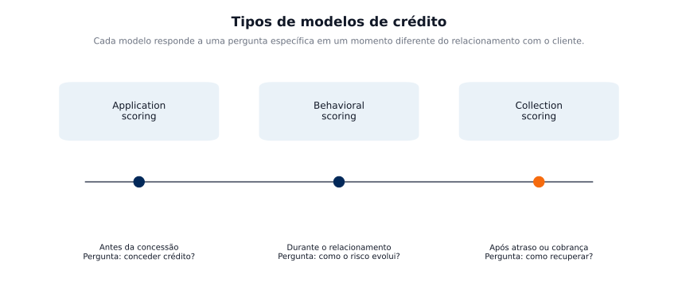{width=95% fig-align="center"}

---

## O que muda entre esses modelos?

Ao longo do tempo, mudam:

- o que sabemos sobre o cliente  
- o que queremos decidir  
- o nível de risco observado  

Consequência:

- modelos usam dados diferentes  
- decisões são diferentes  

> O modelo certo depende do momento do cliente.

---

## Como o problema vira análise

1. coleta de dados  
2. tratamento  
3. transformação  
4. modelagem  
5. avaliação  
6. decisão  

> **Agora**: foco na preparação, estruturação e leitura inicial inicial da base.

---

## Base de dados utilizada

Dataset: credit-g (OpenML)

- acesso direto via Python  
- classificação de crédito  
- variáveis reais  

```{python}
#| label: chunk_1
#| echo: true
#| eval: false

from sklearn.datasets import fetch_openml
import pandas as pd

# Carrega a base credit-g
credit = fetch_openml(name="credit-g", version=1, as_frame=True)

# Separando variáveis explicativas e alvo original
X = credit.data.copy()
y = credit.target.copy()

# Juntando tudo
dados = X.copy()
dados["class"] = y

# Visualização inicial
dados.head()
```

---

Dataset: credit-g (OpenML)

```{python}
#| label: chunk_1_visualizar
#| echo: false
#| eval: true

from sklearn.datasets import fetch_openml
import pandas as pd

# Carrega a base credit-g
credit = fetch_openml(name="credit-g", version=1, as_frame=True)

# Separando variáveis explicativas e alvo original
X = credit.data.copy()
y = credit.target.copy()

# Juntando tudo
dados = X.copy()
dados["class"] = y

# Visualização inicial
dados.head()
```

---

## Algumas variáveis visualizadas

- idade  
- duração do crédito  
- histórico  
- valor  
- propósito  
- status  

Cada variável pode indicar risco.

---

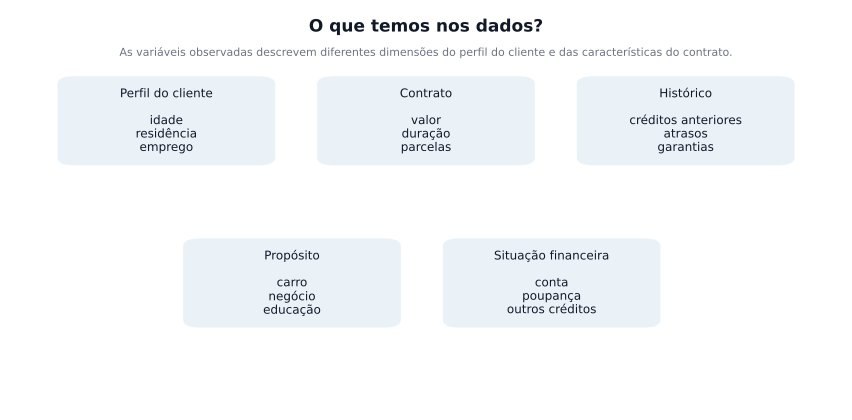{width=95% fig-align="center"}

Cada variável carrega informação que pode ajudar a distinguir clientes com maior ou menor risco.

---

## Definição da variável alvo

- 1 → inadimplente  
- 0 → adimplente  

Problema de classificação binária.

```{python}
#| label: chunk_2
#| echo: true
#| eval: false

# Frequência da variável original
dados["class"].value_counts()
```

```{python}
#| echo: true
#| eval: false

# Criando variável binária
# 1 = inadimplente (bad)
# 0 = adimplente (good)

dados["target"] = (dados["class"] == "bad").astype(int)

dados[["class", "target"]].head(10)
```
---

## Definição da variável alvo

```{python}
#| echo: false
#| eval: true

# Frequência da variável original
dados["class"].value_counts()

# Criando variável binária
# 1 = inadimplente (bad)
# 0 = adimplente (good)

dados["target"] = (dados["class"] == "bad").astype(int)

dados[["class", "target"]].head(7)
```

---


## Distribuição da variável alvo

```{python}
#| label: chunk_3
#| echo: true
#| eval: false

import matplotlib.pyplot as plt

freq = dados["target"].value_counts().sort_index()
freq.index = ["Adimplente (0)", "Inadimplente (1)"]

plt.figure(figsize=(7, 4))
plt.bar(freq.index, freq.values)
plt.title("Distribuição da variável alvo")
plt.ylabel("Frequência")
plt.show()
```

---

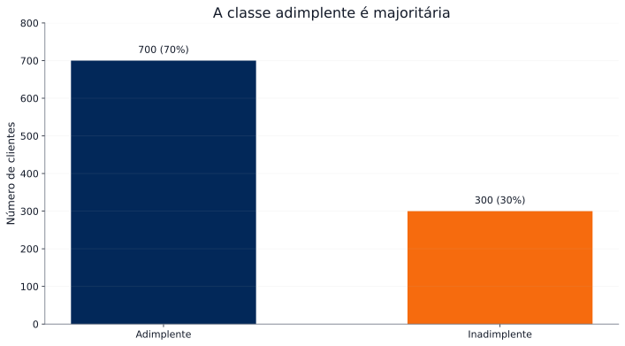{width=95% fig-align="center"}

---

## Dados desbalanceados

- maioria paga  
- poucos entram em default (tornam-se inadimplentes) 

Problema:

- métricas podem enganar  

Exemplo:

- prever sempre “bom” → alta acurácia  

> Em classes raras, acurácia não é suficiente [@sklearn_model_eval].

---


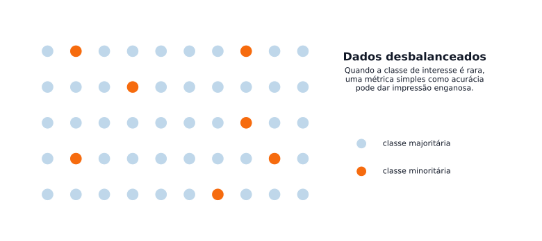{width=95% fig-align="center"}

Se a maioria dos clientes paga, o que acontece se o modelo prever sempre “vai pagar”?

> Uma acurácia de 95% garante um modelo bom?

---

## Um modelo pode ser inútil

Se 95% pagam:

- prever sempre “bom” → 95% de acurácia  

Mas:

- não identifica clientes de risco  

> Acurácia pode ser enganosa.

---

## Como lidar com desbalanceamento

Existem diferentes estratégias:

- reamostragem dos dados (under/over)  
  
- geração sintética (SMOTE)  

- escolha de métricas adequadas  

- ajuste do *threshold* (ponto de corte)  

Não existe solução única.

> A escolha depende do objetivo do modelo.

---

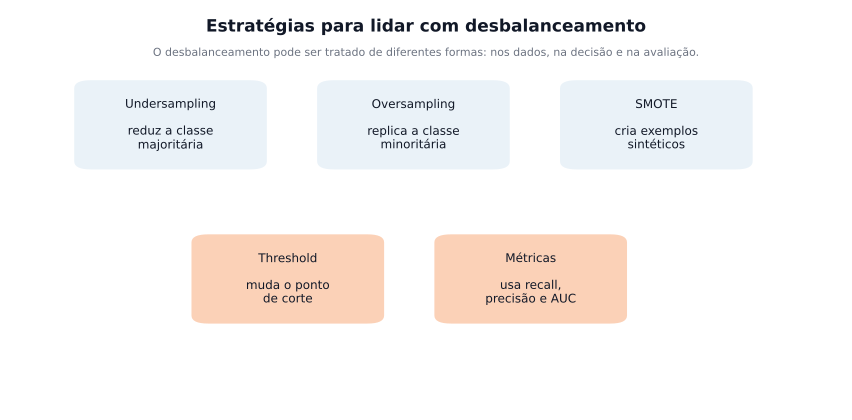{width=95% fig-align="center"}

O desbalanceamento pode ser tratado nos dados, nas métricas e nas regras de decisão, conforme o objetivo do modelo.

---

## Divisão da base de dados

Para avaliar corretamente um modelo, separamos os dados em:

- treino → ajuste do modelo  
- validação → escolha e ajuste de parâmetros  
- teste → avaliação final  

Problema crítico:

- avaliar no treino gera resultados otimistas  

$$
\text{Erro de treino} \leq \text{Erro real}
$$

> Avaliar fora da amostra é essencial para garantir que o modelo funcione na prática [@sklearn_cv].

---

## Uma proposta de divisão da base de dados

{width=95% fig-align="center"}

---

## Dividindo os dados

A divisão é feita de forma estratificada:

- mantém a proporção de inadimplentes  
- evita distorções entre conjuntos  

Parâmetros importantes:

- `random_state` → reprodutibilidade  
- `stratify` → preserva a distribuição da classe  

---

Dividindo os dados

```{python}
#| label: chunk_4
#| echo: true
#| eval: false

from sklearn.model_selection import train_test_split
# 1ª divisão: 80% para treino inicial e 20% para teste
X_train, X_test, y_train, y_test = train_test_split(
    dados.drop(columns=["class", "target"]),  # variáveis explicativas
    dados["target"],                         # variável resposta
    test_size=0.2,                           # 20% para teste
    random_state=42,                         # reprodutibilidade
    stratify=dados["target"]                 # mantém proporção das classes
)
# 2ª divisão: # dos 80% de treino: 75% → treino final e 25% → validação
X_train, X_valid, y_train, y_valid = train_test_split(
    X_train,
    y_train,
    test_size=0.25,        # 25% de 80% = 20% do total
    random_state=42,
    stratify=y_train       # mantém proporção das classes
)
# Resultado final: # Treino: 60%; Validação: 20%; Teste: 20%
print("Treino:", len(X_train))
print("Validação:", len(X_valid))
print("Teste:", len(X_test))
```

Resultado: Treino: 600; Validação: 200; Teste: 200

---

## Transformação de variáveis

Antes da modelagem, os dados precisam ser preparados:

- tratar variáveis categóricas  
- agrupar variáveis contínuas  
- reduzir ruído  
- facilitar interpretação  

Exemplo:

- idade → transformar em faixas  

> Em crédito, interpretação é tão importante quanto desempenho.

---

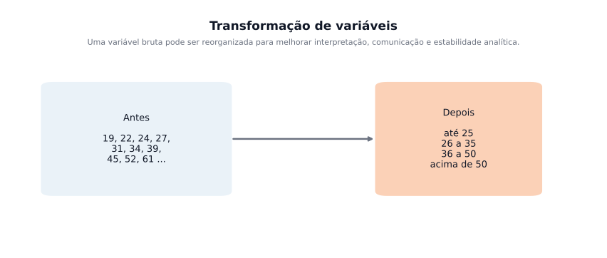{width=95% fig-align="center"}

---

## Antes de modelar, precisamos preparar os dados

Um modelo não corrige problemas nos dados.

- dados inconsistentes → decisões ruins  
- dados mal tratados → modelos enganosos  

> Modelar bons dados é mais importante que escolher o modelo.

---

## O que precisamos verificar?

- dados faltantes  
- tipos de variáveis  
- valores inconsistentes  
- categorias mal definidas  
- escalas diferentes  

> Antes de modelar, precisamos confiar nos dados.

---

## Dados faltantes


Exemplos:

- renda não informada  
- idade ausente  
- histórico incompleto  

O que fazer?

- excluir  
- imputar  
- manter com cuidado  

> A decisão depende do contexto.

---

## Variáveis categóricas

Exemplo:

- "Masculino", "M", "masc"  

São a mesma coisa?

Problema:

- categorias inconsistentes confundem o modelo  

> É necessário padronizar antes de modelar.

---

## Criação de variáveis

Podemos criar novas informações a partir das existentes.

Exemplos:

- renda / dívida  
- tempo de relacionamento  
- frequência de uso  

> Variáveis bem construídas podem ser mais importantes que o modelo.

---

## Discretização de variáveis

Transformar variável contínua em faixas.

Exemplo:

- idade → faixas etárias  

Por quê?

- facilita interpretação  
- captura não linearidade  
- muito usado em crédito  

> Nem sempre o modelo aprende melhor com valores contínuos.

---

## Exemplo: agrupando idade

Variáveis contínuas podem ser transformadas em faixas.

Objetivos:

- facilitar interpretação  
- capturar padrões não lineares  
- reduzir sensibilidade a valores extremos  

> Essa prática é comum em modelagem de crédito.

---

## Criando a variável idade em faixas

```{python}
#| echo: true
#| eval: false

import matplotlib.pyplot as plt
import pandas as pd

# =========================
# Criando faixas de idade
# =========================
dados["faixa_idade"] = pd.cut(
    dados["age"],
    bins=[0, 25, 35, 50, 100],
    labels=["até 25", "26–35", "36–50", "50+"]
)

# Contagem das faixas
faixas = dados["faixa_idade"].value_counts().sort_index()

# Gráfico
plt.figure(figsize=(7, 4))
plt.bar(faixas.index.astype(str), faixas.values)
plt.title("Distribuição das faixas de idade")
plt.ylabel("Frequência")
plt.show()
```

---

## 
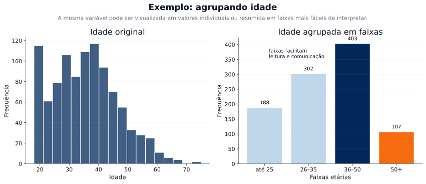{width=95% fig-align="center"}


Em modelos de crédito, variáveis agrupadas ajudam na interpretação e podem capturar melhor diferenças de risco entre perfis.

---

## As faixas ajudam a entender o risco?

Dividimos a idade em grupos.

Mas agora surge a pergunta:

- essas faixas realmente separam clientes bons e maus?  

> São apenas agrupamentos visuais?

---

## Considere duas formas de dividir idade:

Divisão A:

- até 30  
- acima de 30 até 45  
- acima de 45 até 60 
- acima de 60   

Divisão B:

- até 25  
- acima de 25 até 35  
- acima de 25 até 50 
- acima de 50  


---

## O que queremos observar?

Para cada faixa, queremos saber:

- quantos são adimplentes  
- quantos são inadimplentes  

Uma boa divisão:

- concentra perfis semelhantes  
- separa perfis diferentes  

> Isso melhora a capacidade de previsão.

---

```{python}
#| label: chunk_faixa_vs_target
#| echo: true
#| eval: true

import pandas as pd
# Divisão A 
dados["faixa_A"] = pd.cut(
    dados["age"],
    bins=[0, 30, 45, 60, 100],
    labels=["até 30", "31–45", "46–60", "60+"]
)
# Divisão B 
dados["faixa_B"] = pd.cut(
    dados["age"],
    bins=[0, 25, 35, 50, 100],
    labels=["até 25", "26–35", "36–50", "50+"]
)
# Tabelas de proporção
tabela_A = pd.crosstab(dados["faixa_A"], dados["target"], normalize="index")
print(tabela_A)
tabela_B = pd.crosstab(dados["faixa_B"], dados["target"], normalize="index")
print(tabela_B)
```

---

## Observe a proporção de inadimplentes (classe 1):

Divisão A:

- até 30 → 36% 
- 31–45 → 26%  
- 46–60 → 26% 
- 60+ → 22%  

Divisão B:

- até 25 → 42% 
- 26–35 → 30% 
- 36–50 → 24% 
- 50+ → 27%  

---

## Qual divisão evidencia melhor a diferença de risco?

> O objetivo não é agrupar, é separar bons e maus clientes.


```{python}
#| label: fig_comparacao_divisoes
#| echo: false
#| eval: true

import matplotlib.pyplot as plt

# Dados (inadimplência)
faixas_A = ["até 30", "31–45", "46–60", "60+"]
inad_A = [0.360, 0.261, 0.262, 0.222]

faixas_B = ["até 25", "26–35", "36–50", "50+"]
inad_B = [0.421, 0.296, 0.237, 0.274]

plt.figure(figsize=(8, 4))

plt.plot(faixas_A, inad_A, marker='o', label="Divisão A")
plt.plot(faixas_B, inad_B, marker='o', label="Divisão B")

plt.ylabel("Proporção de inadimplentes")
plt.title("Comparação entre formas de discretização")
plt.legend()
plt.grid(alpha=0.2)

plt.show()
```

---

## O que temos até aqui?

- a forma de dividir a variável influencia o resultado  
- divisões diferentes geram níveis diferentes de separação  
- escolher manualmente não é trivial  

> Precisamos de um método que faça isso com base nos dados.

---

## Técnicas específicas de crédito

Algumas técnicas são muito utilizadas em modelagem de crédito:

- *Weight of Evidence* (*WoE*)  
- *Information Value* (*IV*)  
- testes estatísticos e medidas de divergência  

Essas técnicas ajudam a:

- separar melhor bons e maus clientes  
- identificar variáveis mais informativas  
- melhorar a capacidade de discriminação do modelo  


---

## Weight of Evidence (WoE)

Em credit scoring, cada faixa de uma variável pode ser transformada em um número.

Para a faixa $j$:

$$
WoE_j=\ln\left(\frac{\%\,bons_j}{\%\,maus_j}\right)
$$

em que:

- bons = adimplentes  
- maus = inadimplentes  

> O WoE mede o quanto uma faixa está associada a bons ou maus clientes.

---

## Como o Peso da Evidência (WoE) é calculado?

Passos:

1. dividir a variável em faixas  
2. contar bons e maus em cada faixa  
3. calcular proporções  
4. aplicar o logaritmo da razão  

Interpretação:

- $WoE > 0$ → maior concentração de bons  
- $WoE < 0$ → maior concentração de maus

---

## Information Value (IV)

Depois do WoE, podemos medir a força preditiva da variável:

$$
IV=\sum_j (\%\,bons_j-\%\,maus_j)\cdot WoE_j
$$

Leitura prática:

- IV pequeno → variável fraca  
- IV maior → variável mais útil  

> O IV ajuda a priorizar variáveis para o modelo.

---

### WoE — Divisão A  →  **IV total = 0.058**

| Faixa   | Bons | Maus | Prop. Bons | Prop. Maus | WoE     | IV Parcial |
|---------|------|------|------------|------------|---------|------------|
| até 30  | 263  | 148  | 0.376      | 0.493      | -0.272  | 0.032      |
| 31–45   | 298  | 105  | 0.426      | 0.350      |  0.196  | 0.015      |
| 46–60   | 104  |  37  | 0.149      | 0.123      |  0.186  | 0.005      |
| 60+     |  35  |  10  | 0.050      | 0.033      |  0.405  | 0.007      |

### WoE — Divisão B  →  **IV total = 0.088**

| Faixa   | Bons | Maus | Prop. Bons | Prop. Maus | WoE     | IV Parcial |
|---------|------|------|------------|------------|---------|------------|
| até 25  | 110  |  80  | 0.157      | 0.267      | -0.529  | 0.058      |
| 26–35   | 280  | 118  | 0.400      | 0.393      |  0.017  | 0.000      |
| 36–50   | 228  |  71  | 0.326      | 0.237      |  0.319  | 0.028      |
| 50+     |  82  |  31  | 0.117      | 0.103      |  0.125  | 0.002      |

---

## Qual divisão é melhor?

A Divisão B:

- apresenta maior separação entre faixas  
- possui WoE mais distintos  
- tem maior poder preditivo (IV)

Mas:

- ainda não é perfeita  
- algumas faixas não contribuem muito  

> O desafio é encontrar a melhor divisão possível.

---

## Como escolher as faixas?

As faixas podem ser definidas por:

- regra de negócio  
- quantis  
- largura fixa  
- métodos automáticos  

Em crédito, métodos automáticos costumam usar:

- qui-quadrado  
- critérios de separação entre bons e maus  

> A ideia é formar grupos com comportamento de risco diferente.

---

## Observação importante

> Nem toda transformação melhora o modelo.

Precisamos buscar:

- faixas interpretáveis  
- separação entre bons e maus  
- estabilidade  
- coerência com o negócio  

> Em crédito, desempenho e interpretabilidade precisam caminhar juntos.

---

## Aplicando na base em Python

Vamos usar a própria base do curso para:

- discretizar variáveis  
- calcular WoE  
- observar IV  
- gerar variáveis transformadas  

---

```{python}
#| label: chunk_6a
#| echo: true
#| eval: false

# Dados faltantes por coluna
dados.isna().sum().sort_values(ascending=False).head(10)
# Duplicatas
print("Número de linhas duplicadas:", dados.duplicated().sum())
# Tipos das variáveis
dados.dtypes.head(15)
```

```{python}
#| label: chunk_6b
#| echo: true
#| eval: false

import numpy as np
import pandas as pd

# Transformações simples

# Log do valor do crédito
dados["log_credit_amount"] = np.log1p(dados["credit_amount"])

# Crédito médio por mês
dados["credit_per_month"] = dados["credit_amount"] / dados["duration"]

# Faixas de idade
dados["faixa_idade"] = pd.cut(
    dados["age"],
    bins=[0, 25, 35, 50, 100],
    labels=["até 25", "26–35", "36–50", "50+"]
)

dados[["age", "faixa_idade", "credit_amount", "log_credit_amount", "credit_per_month"]].head()
```

---

```{python}
#| label: chunk_6b2
#| echo: false
#| eval: true

import numpy as np
import pandas as pd

# =========================
# Transformações simples
# =========================

# Log do valor do crédito
dados["log_credit_amount"] = np.log1p(dados["credit_amount"])

# Crédito médio por mês
dados["credit_per_month"] = dados["credit_amount"] / dados["duration"]

# Faixas de idade
dados["faixa_idade"] = pd.cut(
    dados["age"],
    bins=[0, 25, 35, 50, 100],
    labels=["até 25", "26–35", "36–50", "50+"]
)

dados[["age", "faixa_idade", "credit_amount", "log_credit_amount", "credit_per_month"]].head()
```

---

```{python}
#| label: chunk_6c
#| echo: true
#| eval: false


## Observe o uso do pacote scorecardpy
import scorecardpy as sc

base_woe = dados.copy()
base_woe["inad"] = base_woe["target"]

# Seleção de algumas variáveis para exemplo
vars_exemplo = [
    "age",
    "credit_amount",
    "duration",
    "credit_per_month",
    "log_credit_amount",
    "inad"
]
base_woe = base_woe[vars_exemplo]

# Binning automático
bins = sc.woebin(base_woe, y="inad")

# Tabela de bins
bins["age"]
```

---

```{python}
#| label: chunk_6c_de
#| echo: false
#| eval: true

import scorecardpy as sc

base_woe = dados.copy()
base_woe["inad"] = base_woe["target"]

# Seleção de algumas variáveis para exemplo
vars_exemplo = [
    "age",
    "credit_amount",
    "duration",
    "credit_per_month",
    "log_credit_amount",
    "inad"
]
base_woe = base_woe[vars_exemplo]

# Binning automático
bins = sc.woebin(base_woe, y="inad")
# Tabela de bins
bins["age"]
```

---

```{python}
#| label: chunk_6d
#| echo: true
#| eval: true

# Aplicando transformação WOE
base_woe_transf = sc.woebin_ply(base_woe, bins)

base_woe_transf.head()
```

---

```{python}
#| label: chunk_6e
#| echo: true
#| eval: true

# Information Value de cada variável
iv = sc.iv(base_woe, y="inad")
iv.sort_values("info_value", ascending=False)
```


---

## Exemplo de transformação de variável

Além de discretizar, podemos criar novas variáveis.

Exemplos:

- crédito por mês = valor do crédito / duração  
- log do valor do crédito  
- faixas de idade  

> Variáveis derivadas podem resumir melhor o risco do que as originais.

---

## Ideia central

Antes de modelar, podemos:

- tratar a base  
- discretizar variáveis  
- criar novas variáveis  
- transformar informações em sinais de risco  

> Modelos de crédito costumam depender fortemente dessa etapa.

---


## O que aprendemos hoje

- risco de crédito é decisão sob incerteza  
- erros têm impactos econômicos distintos  
- os dados são naturalmente desbalanceados  
- a divisão correta evita avaliações incorretas  
- a transformação influencia diretamente o modelo  


> Hoje estruturamos o problema.

> Agora que sabemos como o problema é estruturado, a próxima pergunta é: como transformar isso em um modelo que realmente ajude a decidir?

---

## Referências essenciais

::: {#refs}
:::
 
---

::: {.columns}

::: {.column width="40%"}

{width=75% fig-align="center"}

:::

::: {.column width="60%"}

### Laboratório de Inovação em Estatística

<div class="link-card">
  🌐 <a href="https://statlab-oficial.github.io/site_statlab/" target="_blank">Site</a>
</div>

<div class="link-card">
  📸 <a href="https://www.instagram.com/statlab_oficial/" target="_blank">Instagram</a>
</div>

<div class="link-card">
  💼 <a href="https://www.linkedin.com/in/laboratório-de-inovação-em-estatística-e-ciência-de-dados-statlab-ab653330b" target="_blank">LinkedIn</a>
</div>

<div class="link-card">
  💻 <a href="https://github.com/statlab-oficial/" target="_blank">GitHub</a>
</div>

<div class="link-card">
  ✉️ <a href="mailto:statlab@ufc.br">Email</a>
</div>

:::

:::

---

## 

{width=100% fig-align="center"}

---

## 

{width=100% fig-align="center"}

---

## Vamos continuar

Na Parte 1:

- estruturamos o problema  
- trabalhamos com os dados  
- Compreendemos o custo dos erros  

Agora:

> como usar isso para tomar decisões?


---

## O problema que queremos resolver

Queremos estimar a probabilidade de um indivíduo se tornar inadimplente dado o seu histórico:

$$
P(Y=1 \mid X)
$$

em que:

- $Y=1$ → inadimplência  
- $X$ → características do cliente  

Mas estimar não é suficiente.

> Precisamos transformar probabilidade em decisão prática.

---

## Do dado à decisão

Fluxo do processo:

1. Trabalhar com os dados  
2. Ajustar um modelo  
3. Obter probabilidades individuais  
4. construir um critério de decisão  

O modelo gera probabilidades.

> A decisão depende de como usamos essas probabilidades.

---

## 

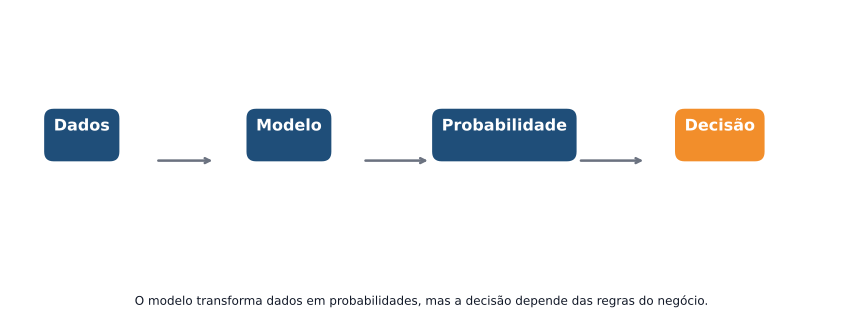{width=95% fig-align="center"}

---

## Probabilidade em si não é decisão

Considere dois clientes e suas respectivas probabilidades de se tornar inadimplente: 

- **Cliente A**: a probabilidade **ESTIMADA** de não quitar a dívida é 0,49  
- **Cliente B**: a probabilidade **ESTIMADA** de não quitar a dívida é 0,51  

Pergunta:

> Um deve ser aprovado e o outro negado?

> Essa diferença é relevante?

👉 O modelo não decide. Quem decide é a regra de negócio.


---

## Por que regressão logística?

A regressão logística é amplamente usada porque:

- produz probabilidades  
- é interpretável  
- é estável  
- é aceita em regulação  

> Em crédito, é o principal modelo base (baseline) [@hand_henley_1997; @lessmann_2015].

---

## O que o modelo entrega?

Para cada cliente:

- um valor entre 0 e 1  

Isso representa:

> a probabilidade de inadimplência

---

## Como transformar o histórico do cliente em probabilidade?

> Queremos transformar uma combinação de variáveis em um valor entre 0 e 1.

A ideia é usar uma função que:

- receba qualquer valor  
- produza uma probabilidade  

Uma escolha comum é:

$$
P(Y=1 \mid X) = \frac{1}{1 + e^{-z}}
$$
$z$ representa uma combinação das variáveis $X's$.

---

## O que é esse $z$?

O termo $z$ representa uma combinação linear das variáveis:

$$
z = \beta_0 + \beta_1 X_1 + \beta_2 X_2 + \ldots + \beta_p X_p
$$

Neste caso temos:

- cada variável contribui para o risco  
- os coeficientes medem esse impacto  

> O modelo transforma essa combinação em probabilidade.

---

## Modelo logístico


$$
P(Y_i=1 \mid X_i) = \frac{1}{1 + \exp\{-\eta_i\}}
$$

em que

$$
\eta_i = \beta_0 + \beta_1 X_{i1} + \beta_2 X_{i2} + \ldots + \beta_p X_{ip}
$$

Isso garante:

- valores entre 0 e 1  
- interpretação probabilística  

> É um modelo simples, mas muito eficaz em crédito.

---

## 

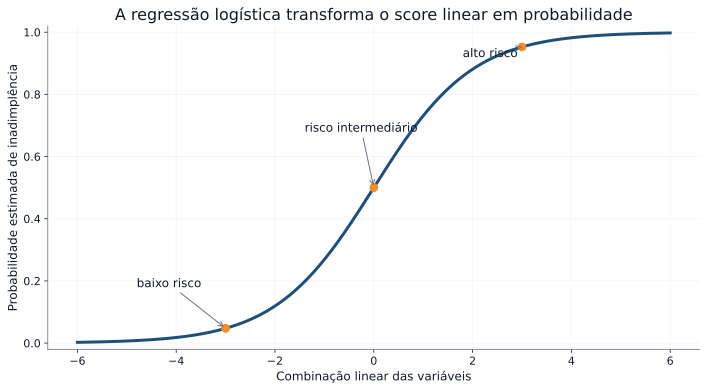{width=95% fig-align="center"}

---

## Interpretação dos coeficientes

Na regressão logística ($Y=1$ → inadimplência):

- coeficiente positivo → aumenta o risco  
- coeficiente negativo → reduz o risco  

Cada variável influencia a probabilidade de inadimplência.

> O modelo permite entender o efeito de cada característica do cliente.

> **Atenção:** o tamanho dos coeficientes não deve ser comparado diretamente entre variáveis, pois elas podem estar em escalas diferentes.  
> Para comparações, é necessário padronizar as variáveis ou analisar com cuidado.

---

## Exemplo: renda

Considere a variável renda:

- coeficiente negativo  

Interpretação:

- quanto maior a renda, menor o risco de inadimplência  

Ou seja:

> clientes com maior renda tendem a ter menor probabilidade de não pagamento  

Em modelos de crédito, essa relação também pode ser analisada por meio de **odds** (chance relativa).

---

## O que são odds?

Odds compara a chance de acontecer com a chance de não acontecer  

Exemplo:

- probabilidade de inadimplência = 20%  
- probabilidade de não inadimplência = 80%  

Então a odds de inadimplência é:

$$
\text{odds} = \frac{\text{probabilidade de inadimplência}}{1-\text{probabilidade de inadimplência}} = \frac{0,20}{0,80} = \frac{1}{4} = 0,25
$$

Interpretação:

> para cada 1 cliente inadimplente, há cerca de 4 adimplentes

---

## Por que não usar odds diretamente?

Odds são úteis, mas:

- não variam de forma linear  
- pequenas mudanças nas variáveis podem gerar variações difíceis de interpretar  

Precisamos de uma transformação mais adequada para modelagem.

---

## Por que usar log-odds?

O modelo logístico trabalha com:

$$
\log\left(\frac{p}{1-p}\right) = \beta_0 + \beta_1 X_{i1} + \beta_2 X_{i2} + \ldots + \beta_p X_{ip},
\quad p = P(Y_i=1 \mid X_i)
$$

Essa transformação:

- leva as odds para uma escala linear  
- permite modelar o efeito das variáveis de forma aditiva  

> isso viabiliza o uso de um modelo log-linear

---

## Interpretando o efeito

Cada coeficiente atua sobre o **log-odds de inadimplência**.

Na prática:

- coeficiente positivo → aumenta o log-odds → aumenta o risco  
- coeficiente negativo → reduz o log-odds → reduz o risco  

Ou seja:

> as variáveis influenciam o risco por meio dos log-odds

👉 Mesmo pequenas mudanças no log-odds podem gerar mudanças relevantes na probabilidade.

---

## Relembrando a divisão dos dados

Na Parte 1, separamos a base em conjuntos diferentes.

Agora vamos usar:

- treino → para ajustar o modelo  
- teste → para avaliar o desempenho  

Por quê?

- o modelo aprende no treino  
- e é avaliado em dados que não viu antes  

> isso evita uma avaliação otimista do modelo

---

## Ajustando o modelo no Python

```{python}
#| label: chunk_6
#| echo: true
#| eval: false

from sklearn.linear_model import LogisticRegression

# Transformar variáveis categóricas em numéricas
X_train_dum = pd.get_dummies(X_train, drop_first=True)
X_test_dum  = pd.get_dummies(X_test, drop_first=True)

# Garantir mesmas colunas em treino e teste
X_train_dum, X_test_dum = X_train_dum.align(X_test_dum, fill_value=0)

# Ajustar o modelo usando os dados de treino
modelo_log = LogisticRegression(max_iter=1000)
modelo_log.fit(X_train_dum, y_train)

# Obter probabilidades de inadimplência no teste
y_prob_log = modelo_log.predict_proba(X_test_dum)[:, 1]
```

---

## O que o código faz?

Etapas principais:

- transforma variáveis categóricas em numéricas  
- ajusta o modelo usando os dados de treino  
- aplica o modelo aos dados de teste  

Resultado:

- para cada cliente no teste, o modelo retorna uma probabilidade de inadimplência  

> essas probabilidades serão usadas para avaliar o modelo

---

## Probabilidades previstas

Cada cliente recebe um score:

- valor entre 0 e 1  
- interpretação probabilística  

Exemplo:

- 0,8 → alto risco  
- 0,1 → baixo risco  

> o modelo quantifica risco, não toma decisão

---

## A distribuição mostra como o modelo diferencia níveis de risco entre os clientes.

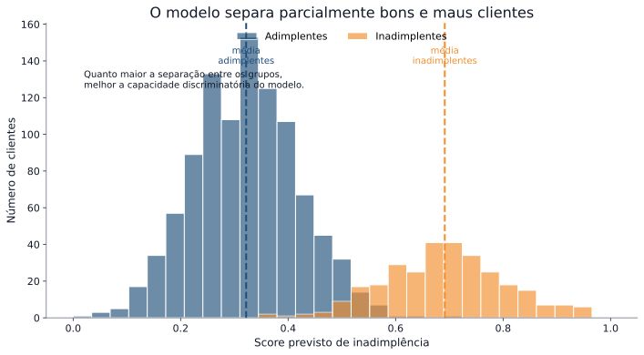{width=95% fig-align="center"}

---

## Da probabilidade para a decisão

O modelo retorna probabilidades de inadimplência.

Mas precisamos tomar uma decisão:

- aprovar  
- rejeitar  

Para isso, usamos um ponto de corte (*threshold*).

Exemplo:

- se probabilidade ≥ 0,5 → classifica como inadimplente  
- caso contrário → adimplente  

> o valor 0,5 é uma escolha inicial, não necessariamente a melhor

---

## Classificando os clientes

**Ponto de corte (threshold)**

```{python}
#| label: chunk_10_a
#| echo: true
#| eval: false

# Classificação usando threshold de 0.5
y_pred_log = (y_prob_log >= 0.5).astype(int)
```

**Matriz de Confusão**

```{python}
#| label: chunk_10
#| echo: true
#| eval: false

from sklearn.metrics import confusion_matrix, ConfusionMatrixDisplay

cm = confusion_matrix(y_test, y_pred_log)
disp = ConfusionMatrixDisplay(confusion_matrix=cm)
disp.plot()
plt.title("Matriz de Confusão")
plt.show()
```

- transformando probabilidades em classes

- definindo quem é considerado inadimplente

> agora podemos comparar com a realidade

---

## Matriz de confusão

Queremos comparar o que realmente aconteceu com o que o modelo previu  

|        | Prevê adimplente (0) | Prevê inadimplente (1) |
|--------|---------------------|------------------------|
| Real 0 (adimplente)   | acertou cliente bom (VN) | classificou como risco sem ser (FP) |
| Real 1 (inadimplente) | deixou passar um cliente de risco (FN) | acertou cliente de risco (VP) |

Nem todos os erros têm o mesmo impacto:

- FP → perda financeira direta  
- FN → perda de oportunidade  

> mudar o *threshold* muda os erros do modelo

---

## Visualização dos acertos e erros do modelo.

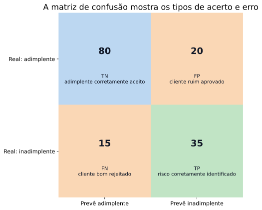{width=95% fig-align="center"}

---

## Como avaliar um modelo?

Depois de ajustar o modelo, precisamos entender se ele é útil.

1. Ele consegue separar clientes bons e maus?  
2. As probabilidades estimadas fazem sentido?  
3. Ele ajuda na tomada de decisão?  

Em outras palavras:

- o modelo distingue bem os perfis?  
- as previsões são coerentes?  
- as decisões geradas são adequadas?  

> métricas são ferramentas para responder essas perguntas

---

## Métricas de avaliação

Para responder essas perguntas, usamos métricas.

- acurácia → proporção total de acertos  
- sensibilidade (*recall*) → capacidade de identificar inadimplentes  
- precisão → entre os classificados como inadimplentes, quantos realmente são  

Cada métrica destaca um aspecto diferente do desempenho.

> a escolha da métrica depende do objetivo da análise

---

## Curva ROC

A curva ROC avalia o desempenho do modelo para diferentes valores de *threshold*.

Ela relaciona:

- TPR (taxa de verdadeiros positivos) → proporção de inadimplentes corretamente identificados  
- FPR (taxa de falsos positivos) → proporção de clientes bons classificados como inadimplentes  

Ou seja:

- TPR mede a capacidade de identificar risco  
- FPR mede o erro com clientes bons  

> a curva mostra o equilíbrio entre acertos e erros ao variar o threshold

---

## Curva ROC no Python


```{python}
#| label: chunk_8
#| echo: true
#| eval: false

from sklearn.metrics import roc_curve, roc_auc_score
import matplotlib.pyplot as plt

fpr, tpr, _ = roc_curve(y_test, y_prob_log)
auc = roc_auc_score(y_test, y_prob_log)

plt.figure()
plt.plot(fpr, tpr, label=f"AUC = {auc:.3f}")
plt.plot([0,1], [0,1], linestyle="--")
plt.xlabel("FPR (taxa de falsos positivos)")
plt.ylabel("TPR (sensibilidade)")
plt.title("Curva ROC")
plt.legend()
plt.show()
```


---

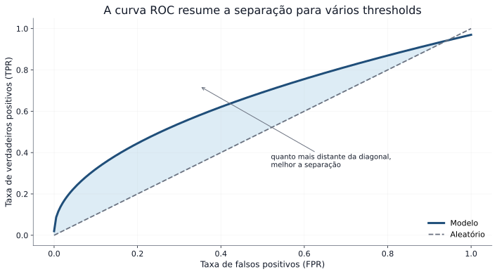{width=95% fig-align="center"}

---

## AUC (Área sob a curva)

A AUC mede a capacidade do modelo de separar bons e maus clientes.

$$
AUC = P(\text{cliente inadimplente receber maior probabilidade que cliente adimplente})
$$

Ou seja:

- escolhemos um cliente inadimplente e um adimplente ao acaso  
- verificamos se o modelo atribui maior risco ao inadimplente  

- quanto maior a AUC → melhor a separação  

> a AUC avalia ordenação, não garante boa decisão nem boas probabilidades [@sklearn_model_eval]

---

## *Precision–Recall*

Importante quando a inadimplência é rara.

Foco na classe positiva (inadimplentes):

- precisão → entre os clientes classificados como inadimplentes, quantos realmente são  
- *recall* (sensibilidade) → quantos inadimplentes o modelo consegue identificar  

Em contextos com poucos inadimplentes:

- a precisão reduz falsos alarmes  
- o *recall* reduz clientes de risco não identificados  

> mais adequado quando a classe de interesse é rara

---

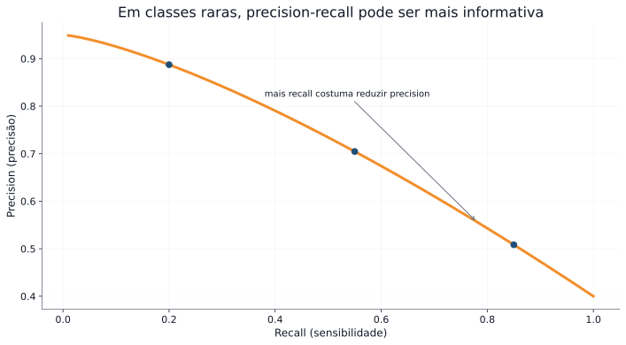{width=95% fig-align="center"}

---

## O papel do *threshold*

Aqui, $p$ representa:

- a probabilidade de inadimplência do cliente  

A classificação depende de um ponto de corte $t$:

- $p > t$ → classifica como cliente de risco (inadimplente)  
- $p \leq t$ → classifica como cliente sem risco (adimplente)  

Na prática, esse valor define:

- quais clientes são considerados de risco  
- quais clientes são aprovados  

> o *threshold* controla a decisão do modelo

---

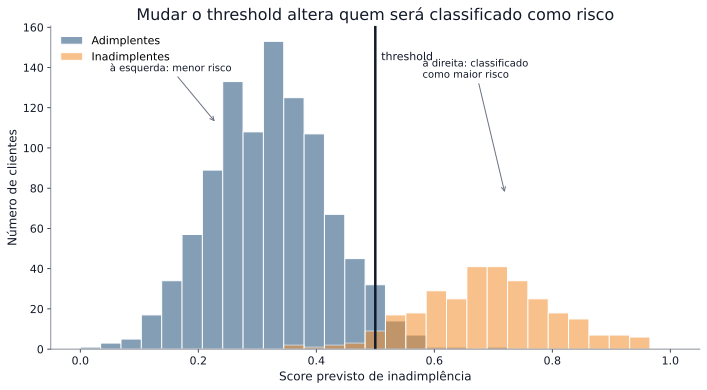{width=90% fig-align="center"}
Ao alterar o *threshold*:

- mudamos a quantidade de clientes classificados como risco  
- alteramos o nível de rigor da decisão

---

## Efeito do ponto de corte (*threshold*)

- *threshold* baixo → mais clientes classificados como risco  
- *threshold* alto → menos clientes classificados como risco  

Consequência:

- mais clientes podem ser aprovados ou rejeitados  
- aumentam ou diminuem os erros do modelo  

Em particular:

- falsos positivos (FP) → clientes bons classificados como risco  
- falsos negativos (FN) → clientes de risco não identificados  

> o *threshold* determina o tipo de erro mais frequente

---

## Custo e decisão

Da 1ª Parte:

$$
\text{Custo} = c_{FP} \cdot FP + c_{FN} \cdot FN
$$

Em crédito:

- $c_{FP}$ → perda financeira direta (aprovar quem não paga)  
- $c_{FN}$ → perda de oportunidade (rejeitar quem pagaria)  

Como o *threshold* altera FP e FN:

> ele também altera o custo total das decisões

> o melhor modelo não é o mais preciso, é o que gera menor custo

---

## Então qual é o melhor modelo?

Não é necessariamente:

- o de maior AUC  
- o mais complexo  

Mas sim:

> o que leva à melhor decisão prática

👉 isso depende do contexto e dos custos envolvidos

---

## Decisão ótima

A escolha do threshold deve:

- minimizar o custo esperado  
- considerar o contexto do negócio  

$$
\min \left(c_{FP} \cdot FP + c_{FN} \cdot FN\right)
$$

> um bom modelo não garante uma boa decisão  
> a decisão depende de como usamos o modelo

---

## Outros modelos

Além da regressão logística, podemos usar outros modelos para estimar o risco de crédito. Exemplos:

- Árvore de decisão  
- Random Forest  
- Gradient Boosting  

Esses modelos:

- capturam relações não lineares  
- identificam interações entre variáveis automaticamente  

> todos têm o mesmo objetivo: estimar a probabilidade de inadimplência

---

## Intuição dos modelos

- Logística → relação linear com log-odds e interpretação direta  
- Árvore → decisões baseadas em regras (“se... então...”)  
- Random Forest → combinação de várias árvores para reduzir instabilidade  
- Boosting → sequência de modelos que corrige erros anteriores  

> cada modelo aprende padrões diferentes nos dados

---

## Comparação de modelos

| Modelo | Vantagem | Limitação |
|--------|----------|-----------|
| Logística | interpretável e estável | assume relação linear com log-odds |
| Árvore | fácil de explicar | alta variabilidade |
| Random Forest | robusto e reduz overfitting | menor interpretabilidade |
| Boosting | alto poder preditivo | maior complexidade |

> não existe modelo universalmente melhor [@lessmann_2015]

---

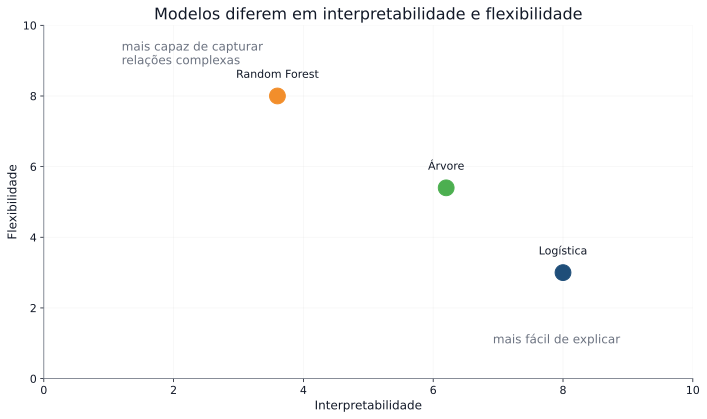{width=95% fig-align="center"}

Diferentes modelos podem levar a diferentes níveis de desempenho e interpretação.

---

## Na prática

Em crédito:

- regressão logística → modelo padrão (baseline)  
- modelos mais complexos → usados para comparação e ganho de desempenho  

Por quê?

- interpretabilidade é essencial  
- exigências regulatórias favorecem modelos explicáveis  

> modelos mais complexos podem melhorar desempenho,  
> mas exigem maior cuidado na interpretação e validação

---

## O que não muda

Independentemente do modelo:

- todos estimam probabilidade de inadimplência  
- todos dependem de dados e variáveis  
- todos precisam de um *threshold* para decisão  

> o modelo muda, mas o problema continua o mesmo

---

## *Overfitting* (sobreajuste)

O modelo pode se ajustar demais aos dados de treino:

- aprende padrões reais  
- mas também aprende ruído  

Resultado:

- desempenho ótimo no treino  
- desempenho pior em dados novos  

> o objetivo não é ajustar bem o treino,  
> é generalizar para novos dados

---

## Por que isso importa?

Um modelo com *overfitting* pode:

- parecer ótimo nos dados de treino  
- mas tomar decisões ruins na prática  

> avaliar corretamente é essencial para tomar boas decisões

---

## Validação

Para avaliar corretamente o modelo:

- usar dados que não foram usados no ajuste  
- utilizar validação cruzada  

Isso permite:

- estimar o desempenho em novos dados  
- reduzir o risco de *overfitting*  

---

## Validação no Python

```{python}
#| label: chunk_11
#| echo: true
#| eval: false

from sklearn.model_selection import cross_val_score

scores = cross_val_score(
    modelo_log,
    X_train,
    y_train,
    cv=5,
    scoring="roc_auc"
)

print("AUC média (validação):", scores.mean())

```

> Avaliação fora da amostra é essencial [@sklearn_cv].

---

## E se mudarmos o modelo?

Até agora usamos regressão logística.

Mas outros modelos podem capturar padrões mais complexos:

- relações não lineares  
- interações entre variáveis  

> vamos comparar diferentes modelos

---

## Árvore de Decisão

- modelo baseado em regras
- divide os dados em grupos mais homogêneos

> fácil de interpretar, mas pode variar bastante

```{python}
#| label: chunk_12
#| echo: true
#| eval: false

from sklearn.tree import DecisionTreeClassifier

modelo_tree = Pipeline(steps=[
    ("prep", preprocess),
    ("model", DecisionTreeClassifier(max_depth=5, random_state=42))
])

modelo_tree.fit(X_train, y_train)
y_prob_tree = modelo_tree.predict_proba(X_test)[:, 1]

```

---

## Floresta Aleatória (*Random Forest*) 

 - combina várias árvores
 - reduz variabilidade do modelo

> mais robusto, porém menos interpretável

```{python}
#| label: chunk_13
#| echo: true
#| eval: false

from sklearn.ensemble import RandomForestClassifier

modelo_rf = Pipeline(steps=[
    ("prep", preprocess),
    ("model", RandomForestClassifier(n_estimators=100, random_state=42))
])

modelo_rf.fit(X_train, y_train)
y_prob_rf = modelo_rf.predict_proba(X_test)[:, 1]

```

---

## Comparação de modelos

| Modelo | Vantagem | Limitação |
|--------|----------|-----------|
| Logística | interpretável e estável | assume relação linear |
| Árvore | fácil de explicar | alta variabilidade |
| *Random Forest* | robusto | menor interpretabilidade |

> não existe modelo universalmente melhor [@lessmann_2015]

```{python}
#| label: chunk_14
#| echo: true
#| eval: false

from sklearn.metrics import roc_auc_score

auc_log = roc_auc_score(y_test, y_prob_log)
auc_tree = roc_auc_score(y_test, y_prob_tree)
auc_rf = roc_auc_score(y_test, y_prob_rf)

print("AUC Logística:", auc_log)
print("AUC Árvore:", auc_tree)
print("AUC Random Forest:", auc_rf)
```

---

## Comparando modelos na prática

```{python}
#| label: chunk_15
#| echo: true
#| eval: false

fpr_log, tpr_log, _ = roc_curve(y_test, y_prob_log)
fpr_tree, tpr_tree, _ = roc_curve(y_test, y_prob_tree)
fpr_rf, tpr_rf, _ = roc_curve(y_test, y_prob_rf)

plt.figure()
plt.plot(fpr_log, tpr_log, label="Logística")
plt.plot(fpr_tree, tpr_tree, label="Árvore")
plt.plot(fpr_rf, tpr_rf, label="Random Forest")
plt.plot([0,1], [0,1], linestyle="--")

plt.xlabel("FPR")
plt.ylabel("TPR")
plt.title("Comparação de Modelos")
plt.legend()
plt.show()
```

> modelos diferentes podem ter desempenhos diferentes  
> mas isso não garante melhor decisão final

---

## Modelo vs decisão

Um modelo pode ter:

- maior AUC  
- melhor separação  

Mas ainda assim:

- não gerar a melhor decisão  

> a decisão depende do threshold e dos custos

---

## Quando usar cada modelo?

- Logística → quando precisa explicar decisões  
- Árvore → quando quer regras simples  
- *Random Forest* → quando busca robustez  
- *Boosting* → quando busca maior desempenho  

Mas:

> a escolha depende do contexto, dos dados e do objetivo da decisão

---

## E na prática do mercado?

Em instituições financeiras:

- modelos podem ser adquiridos de bureaus de crédito  
- modelos internos são desenvolvidos e ajustados  
- modelos precisam ser monitorados continuamente  

Além disso:

- decisões devem ser justificáveis  
- modelos precisam ser auditáveis  

> a instituição continua responsável pelas decisões [@sr117; @cfpb_2022]

---

## O que aprendemos hoje

- modelos geram probabilidades de risco  
- métricas avaliam desempenho  
- o threshold define a decisão  
- o custo define a melhor escolha  
- diferentes modelos podem ser comparados  

> modelar é importante  
> decidir é essencial

---

## Referências essenciais

::: {#refs}
:::

> Essas referências sustentam os conceitos apresentados neste módulo.

---

::: {.columns}

::: {.column width="40%"}

{width=75% fig-align="center"}

:::

::: {.column width="60%"}

### Laboratório de Inovação em Estatística

<div class="link-card">
  🌐 <a href="https://statlab-oficial.github.io/site_statlab/" target="_blank">Site</a>
</div>

<div class="link-card">
  📸 <a href="https://www.instagram.com/statlab_oficial/" target="_blank">Instagram</a>
</div>

<div class="link-card">
  💼 <a href="https://www.linkedin.com/in/laboratório-de-inovação-em-estatística-e-ciência-de-dados-statlab-ab653330b" target="_blank">LinkedIn</a>
</div>

<div class="link-card">
  💻 <a href="https://github.com/statlab-oficial/" target="_blank">GitHub</a>
</div>

<div class="link-card">
  ✉️ <a href="mailto:statlab@ufc.br">Email</a>
</div>

:::

:::

 